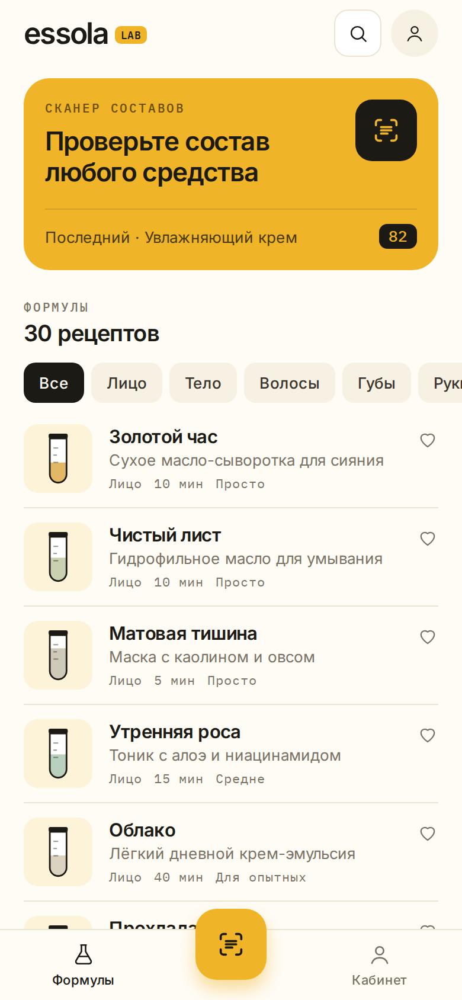
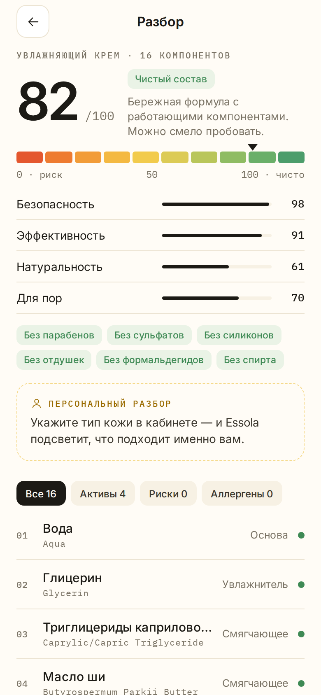
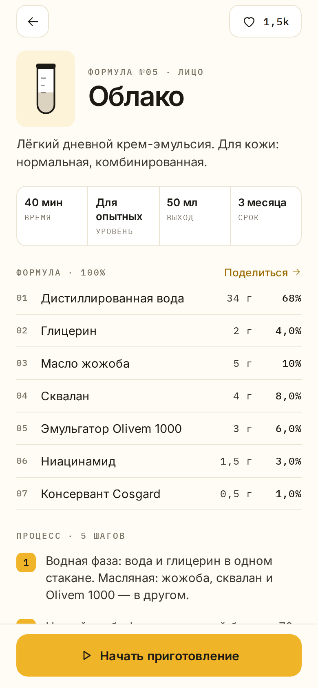
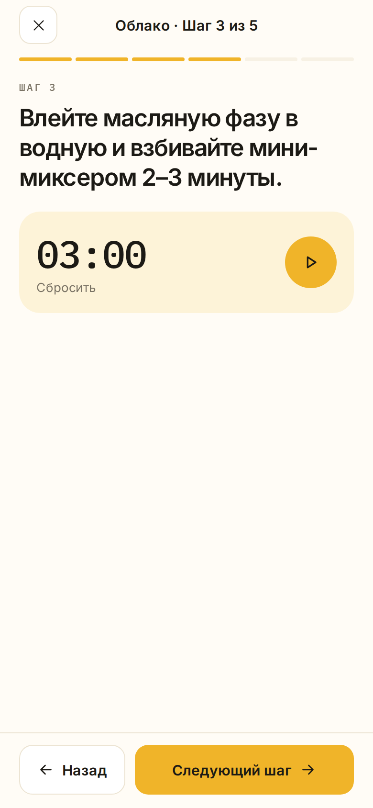
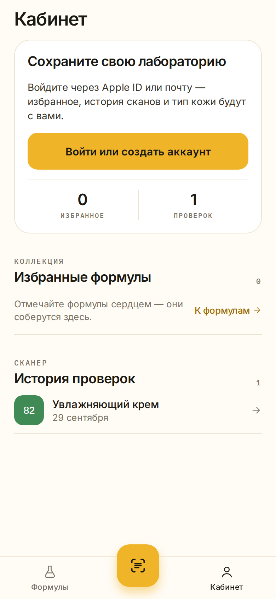

# The Essola — лаборатория косметики

Мобильное приложение на Expo (SDK 57) + React Native + Expo Router.

Стиль «Мёд»: ванильный белый, графит и медовый акцент; рецепты — пробирки, оценка состава — шкала как тест-полоска pH.

| Главная | Разбор состава | Формула | Приготовление | Кабинет |
|---|---|---|---|---|
|  |  |  |  |  |

## Что внутри

- **База рецептов** — 30 рецептов домашней косметики (лицо, тело, волосы, губы, руки, ванна): дозировки, шаги, сроки хранения, советы и предупреждения. Поиск по названию и ингредиентам, фильтры, чек-лист ингредиентов, «поделиться». Лайки с анимацией и хаптикой, раздел «Избранное».
- **Сканер составов** — фото с камеры или из галереи → распознавание текста на устройстве (ML Kit / Apple Vision через `expo-text-extractor`) → разбор INCI. Можно вставить состав текстом. Анализ устойчив к OCR-шуму: переносы, опечатки (нечёткое сравнение), скобки, проценты.
  - база ~180 ингредиентов с функцией, происхождением, риском, комедогенностью и пометками (сульфаты, парабены, силиконы, доноры формальдегида, аллергены, беременность);
  - баллы 0–100: **натуральность, безопасность, эффективность, «для пор»** и итоговая оценка с учётом позиции компонента в списке;
  - «звёзды состава», «обратите внимание», «без …», диаграмма назначения компонентов, персональные предупреждения под тип кожи.
- **Личный кабинет** — вход через **Apple ID** или **почту (одноразовый код)**, тип кожи, избранное, история сканов.

## Открыть на телефоне — без компьютера

Один раз: создайте бесплатный аккаунт на expo.dev, сделайте ключ в **Settings → Access tokens** и добавьте его в репозиторий как секрет `EXPO_TOKEN` (**Settings → Secrets and variables → Actions**). Expo Go открывает приложение по интернету только для вошедших в аккаунт Expo.

1. Установите **Expo Go** из App Store / Google Play и войдите в тот же аккаунт Expo.
2. Откройте в репозитории вкладку **Issues → «📱 Essola в Expo Go»** и отсканируйте QR-код камерой.

QR-код публикует GitHub Actions (`.github/workflows/expo-go-preview.yml`): при каждом изменении кода он запускает сервер разработки на GitHub и открывает к нему бесплатный туннель Cloudflare. Сервер живёт ~5,5 часа; чтобы получить новую ссылку, откройте последний запуск в **Actions** и нажмите **Re-run all jobs**.

## Запуск локально

```bash
cd app
npm install
npx expo start --go
```

Сканер фото работает в Expo Go: без нативного модуля текст распознаёт Tesseract внутри скрытого WebView (при первом запуске скачивается модель ~4 МБ). Для большей точности можно бесплатно получить ключ на ocr.space и прописать `EXPO_PUBLIC_OCR_SPACE_KEY` в `.env`. В собственной сборке (`eas build`) используется нативное распознавание Apple Vision / ML Kit.

## Бэкенд (Supabase)

Без настроек приложение работает в **локальном режиме**: аккаунт, лайки и история хранятся на устройстве (для почты подойдёт любой 6-значный код). Чтобы включить настоящие аккаунты и синхронизацию лайков:

1. Создайте проект Supabase, выполните `supabase/schema.sql`.
2. Authentication → Providers: включите **Email** (в шаблоне письма используйте `{{ .Token }}` — приложение ждёт 6-значный код) и **Apple** (Client ID = bundle id `com.essola.lab`).
3. Скопируйте `.env.example` → `.env` и заполните `EXPO_PUBLIC_SUPABASE_URL`, `EXPO_PUBLIC_SUPABASE_ANON_KEY`.

## Структура

```
src/app/            экраны (Expo Router): (tabs)/index, scanner, profile, recipe/[id], cook/[id], analysis/[id], auth
src/components/     UI-кит, пробирки, строки рецептов, иконки
src/context/        авторизация, лайки и история сканов
src/data/           рецепты и база INCI
src/lib/analyze.ts  парсер и скоринг составов
```

## Проверки

```bash
npm run typecheck
npm run test:analyzer
```

Шрифты — Inter и IBM Plex Mono; иконка и сплэш — в `assets/`. Оценки состава носят информационный характер и не заменяют консультацию дерматолога.
